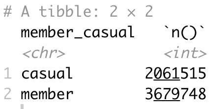

# Cyclistic Case Study
Google Data Analytics Professional Certificate Capstone Project

## Table of contents
- [Introduction](#Introduction)
- [Overview](#Overview)
- [Stage 1: Ask](#Stage-1-Ask)
- [Stage 2: Prepare](#Stage-2-Prepare)
- [Stage 3: Process](#Stage-3-Process)
- [Stage 4: Analyse](#Stage-4-Analyse)
- [Stage 5: Share](#Stage-5-Share)
- [Stage 6:Act](#Stage-6-Act)

## Introduction 
This analysis is a capstone project case study, the final part of the Google Data Analytics Professional Certificate. For this case study, assume the real-world position of a junior data analyst on the marketing analyst team at Cyclistic, a bike-share company in Chicago. 

Undertaking this certified course has introduced me to the six steps of the data analysis process which I will illustrate throughout this project; Ask, Prepare, Process, Analyse, Share and Act. 

## Overview

**Background**
- Founded in 2016, Cyclistic is a Chicago bike–share program  that offers a fleet of 5,824 bikes geotracked into a network of 692 stations. Cyclistic allows riders flexibility, with 8% of riders using assistive bike options and 30% of riders using the bikes work daily work commutes.
- Traditionally, Cyclistic’s marketing strategy was about building a diverse customer base through targeting all segments through offering casual (single ride or full day) or annual (members) pricing plans. 
- As annual members have been deemed to be much more profitable than casual riders, Lily Moreno the director of marketing believes the company’s future success depends on maximizing the number of annual memberships. 
- The direction for future marketing strategies will be focused on the opportunity to convert causal riders into annual members and therefore my team must understand how casual and annual members use Cyclistic bikes differently. 

**Tools** 
- Excel;
- R
- Tableau

## Stage 1: Ask

**Business task:**
To design a new marketing strategy that will convert casual raiders into annual members. 

There are three questions that will help guide the future of the marketing program
1. How do annual members and casual riders use Cyclistic bikes differently?
2. Why would casual riders buy Cyclistic annual memberships?
3. How can Cyclistic use digital media to influence causal riders to become members?

Analyzing the Cyclistic historical bike trip data will help me answer the first question I have been assigned; How do annual members and casual riders use Cyclistic bikes differently?

**Key stakeholders:**
Lily Moreno; Director of marketing and my manager
Cyclistic Executive team; who will decide whether to approve the recommended marketing program

## Stage 2: Prepare 

**Data source - location, licensing and privacy**
The previous 12 months Cyclistic historical trip data (04/2024 to 03/2024)  for this analysis is publicly available dataset which can be accessed [here.](https://divvy-tripdata.s3.amazonaws.com/index.html) and is made available and licensed by Motivate International Inc under this [license.](https://divvybikes.com/data-license-agreement).
Privacy concerns have been addressed with all personally identifiable information of riders being hidden through tokenisation or removed. 

**Organisation and description of files**
The data has been extracted as 12 zipped .csv files, each file representing one month of Cyclistic trip data. The naming convention for these .csv files is YYYYMM-divvy-tripdata.csv 
Each file contains the same 13 columns (ride_id, rideable_type, started_at, ended_at, start_station_name, start_station-_id, end_station_name, end_station_id, start_lat, start_lng, end_lat, end_lng, member_casual) and 100,000s columns of data. 

**Assessing the data**
This data meets the standards of ROCCC, being reliable, original, comprehensive, current and cited and is therefore fit for use for this analysis.

**Limitations of the data**
A limitation of this data arises from removing the personally identifiable information, as we are not able to connect customers based on their credit card information to determine if there are repeat casual riders or demographic information about riders for example. 

## Stage 3: Process

The tools I have decided to use for this analysis
- Excel; Allows me to open up .csv files to familiarise myself with and explore the data. However, due to the capacity constraints of Excel supported file types, I will be using a different tool to combine files into a full dataset. 
- R ;  A tool designed to handle large datasets, requiring fairly simple code and audit trail for reproducibility. 

**Summary of my steps of data cleaning and modification in R**
- Imported 12 .csv files into R and combined into one singular dataset
- Check data type of all columns
- Create new variables
  + Create ride length variable and filter out any invalid values
  + Create month variable
  + Create weekday variable
  + Create type of day variable

- Check for errors or invalid values
  + Check length of ride_id is 16 and unique
  + Check validity of rideable_type values
  + Check for missing values in started_at and ended_at columns
  + Filter out rows that are missing either all information about starting location (start_station_name, start_lat and start_lng) or all information about ending   location(end_station_name, end_lat and end_lng)
  + Check validity of member_casual values
  + Trim station names

Preview the R code I used to do these steps [here](code/stage3_process).

A copy of the clean dataset is available [here](
 

## Stage 4: Analyse

The tools I have decided to use for this analysis
- R; Has the ability to do data cleaning, analysis and presentation through detailed visualisations. 
- Tableau; An analytics platform that allows you to easily manipulate data and make complex and interactive visualisation dashboards.

We want to answer the question "How do annual members and casual riders use Cyclistic bikes differently?",  so the focus of our analysis will be comparing Casual and Members (stored in variable called member_casual) across different variables to see in what ways they are the same and different. 

**Compare count of rides across member and casual users**

Findings; 

**Compare trip duration across member and casual users**

Findings; 

**Compare month across member and casual users**

**Compare type of bike across member and casual users**

tableau 

**Compare day of week or type of day across member and casual users**

**Compare time of day across member and casual users**

Maps

average ride length by time & member type

